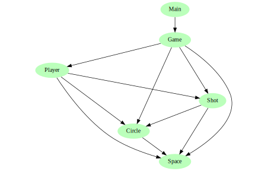

# twinpin


twinpin is a minimal twin-stick shooter. The two players control their
characters with gamepads. So far I have only tried it with a Sony DualShock 4
V2. I develop this game to satisfy my functional programming itch.

## Build dependencies
Stack is used to build the project. Stack will download most of the other build
dependencies but there are some manual steps required to get SDL2 working.

### Windows specific setup
To set up SDL2 for Windows, follow step 1-4 in [this Reddit
post](https://www.reddit.com/r/haskellgamedev/comments/4jpthu/windows_sdl2_is_now_almost_painless_via_stack/).

### Fedora specific setup
install SDL2 with `sudo dnf install SDL2 SDL2-devel`

## How to build and play
`stack build` to build  
`stack exec twinpin-exe` to play twinpin, or  
`stack run` to both build and execute  
`stack test` to run the tests  
`stack deploy.hs` to make a twinpin distribuion for the current operating system
and processor architecture

## Suggested development environment
To develop twinpin, I use Visual Studio Code with the following extensions:
* Haskell Language Server (alanz.vscode-hie-server)
* Rewrap (stkb.rewrap)

Haskell Language Server has a requirement on Haskell IDE Engine. Build it with
the following commands:
```
sudo dnf install libicu-devel ncurses-devel
git clone https://github.com/haskell/haskell-ide-engine --recursive
cd haskell-ide-engine
stack ./install.hs build
```
This differs slightly from the installations instructions found in the [README
for Haskell Language
Server](https://marketplace.visualstudio.com/items?itemName=alanz.vscode-hie-server).
The `build-all` target is not available anymore. We don't want to build
everything anyway since it takes several hours and requires about 30 GB of disk
space. `build` only builds Haskell Language Server with the latests ghc instead
of all 8 available for the Haskell Language Server.

Cabal is needed for Haskell IDE Engine to work properly. To install and update
cabal, run
```
stack install cabal-install
cabal update
```
as written in [this github issue for Haskell IDE
Engine](https://github.com/haskell/haskell-ide-engine/issues/658).

The textures found in [images](images) are edited with [Inkscape](https://inkscape.org/).

## twinpin code architecture
The entry point is found in [Main]. [Main] contains all the IO, in fact all side
effects of twinpin are limited to [Main] only. [Main] communicates with [Game],
which is responsible for updating the game state given some user input. Below is
the complete module dependency graph.



Below [Game] in the graph are:
* [Player], which updates a player's state. A player is represented by a circle
  visually. Given the trigger input a player will fire a shot.
* [Shot], which updates a shot's state. A shot is represented by a circle
  visually.
* [Circle], which contains most of the physics. It updates a circle's position
  given a velocity.
* [Space], which contains the basic data types and geometric functions.

### How to generate graph
The graph was generated with [graphmod](https://github.com/yav/graphmod).
Install it with:
```
stack build --copy-compiler-tool graphmod
```
and generate module-dependencies.svg with:
```
stack exec graphmod | dot -Tsvg > images/module-dependencies.svg
```

[Main]:   app/Main.hs
[Game]:   src/Game.hs
[Player]: src/Player.hs
[Shot]:   src/Shot.hs
[Circle]: src/Circle.hs
[Space]:  src/Space.hs