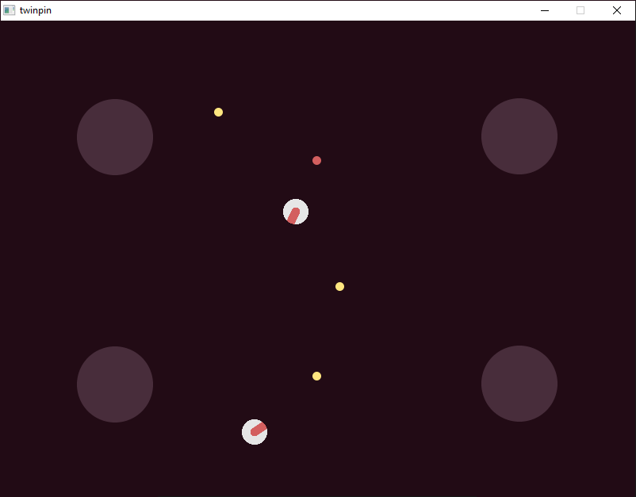

# twinpin


twinpin is a minimal twin-stick arena shooter. I develop this game to satisfy my
functional programming itch.

## Prerequisites
Stack will download most of the build dependencies but there are some manual
steps required to get SDL2 working.

### Windows prerequisites
To set up SDL2 for Windows follow step 1-4 in [this Reddit
post](https://www.reddit.com/r/haskellgamedev/comments/4jpthu/windows_sdl2_is_now_almost_painless_via_stack/).

## How to build and play
`stack build` to build  
`stack exec twinpin-exe` to play twinpin  
`stack test` to run the tests

## Suggested development environment
To develop twinpin I use Visual Studio Code with the following extensions:
* Haskell Language Server (alanz.vscode-hie-server)
* Rewrap (stkb.rewrap)

Haskell Language Server has requirement on Haskell IDE Engine. Instruction for
how to install it is found in the [README for Haskell Language
Server](https://marketplace.visualstudio.com/items?itemName=alanz.vscode-hie-server).
It takes a few hours to build the complete Haskell IDE Engine.

### Windows specific setup
Cabal needed for Haskell IDE Engine to work properly. To install and update
cabal, run
```
stack install cabal-install
cabal update
```
as written in [this github issue for Haskell IDE
Engine](https://github.com/haskell/haskell-ide-engine/issues/658).