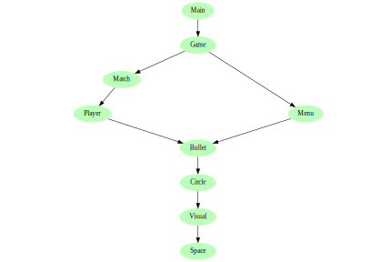

# Twinpin


Twinpin is a minimalistic top-down twin-stick shooter. Each player controls a
circle with their gamepad. Only Sony DualShock 4 V2 are supported so far but
other gamepads have been reported to work as well. I develop this game to
satisfy my functional programming itch. To play, either download [the latest
release](https://github.com/victorjoh/twinpin/releases/latest), or build from
source by following the instructions below.

## Build dependencies
Stack is used to build the project. Stack will download most of the other build
dependencies but there are some manual steps required to get SDL2 working.

### Windows specific setup
To set up SDL2 for Windows, follow step 1-4 in [this Reddit
post](https://www.reddit.com/r/haskellgamedev/comments/4jpthu/windows_sdl2_is_now_almost_painless_via_stack/).

### Fedora specific setup
install SDL2 with `sudo dnf install SDL2 SDL2-devel`

## How to build and play
`stack build` to build  
`stack exec twinpin-exe` to play twinpin, or  
`stack run` to both build and execute  
`stack test` to run the tests  
`stack deploy.hs` to make a twinpin distribuion for the current operating system
and processor architecture

## Suggested development environment
To develop twinpin, I use Visual Studio Code with the following extensions:
* [Haskell Language Server
  (alanz.vscode-hie-server)](https://marketplace.visualstudio.com/items?itemName=alanz.vscode-hie-server)
* [Rewrap
  (stkb.rewrap)](https://marketplace.visualstudio.com/items?itemName=stkb.rewrap)

Haskell Language Server has a requirement on Haskell IDE Engine. Build it with
the following commands:
```
sudo dnf install libicu-devel ncurses-devel
git clone https://github.com/haskell/haskell-ide-engine --recursive
cd haskell-ide-engine
stack ./install.hs build
```

Cabal is needed for Haskell IDE Engine to work properly. To install and update
cabal, run
```
stack install cabal-install
cabal update
```
as written in [this github issue for Haskell IDE
Engine](https://github.com/haskell/haskell-ide-engine/issues/658).

## twinpin code architecture
The entry point is found in [Main]. [Main] contains all the IO, in fact all side
effects of twinpin are limited to [Main] only. [Main] communicates with [Game],
which is responsible for updating the game state given some user input. Below is
the complete module dependency graph. Edges implied by transitivity are not
shown, the image would be too cluttered if they were.



Below [Game] in the graph are:
* [Match], which manages interations between all objects in a match.
* [Menu], which can draw a pause menu that can be used to quit the game.
* [Player], which updates a player's state. A player is represented by a circle
  visually. Given the trigger input a player will fire a bullet.
* [Bullet], which updates a bullet's state. A bullet is represented by a circle
  visually.
* [Circle], which contains most of the physics. It updates a circle's position
  given a velocity.
* [Visual], which contains convenience functions for moving from memory
  representations to drawable images.
* [Space], which contains the basic data types and geometric functions.

### How to generate graph
The graph was generated with [graphmod](https://github.com/yav/graphmod).
Install it with:
```
stack build --copy-compiler-tool graphmod
```
and generate module-dependencies.svg with:
```
stack exec graphmod | tred | dot -Tsvg > doc/module-dependencies.svg
```

[Main]:   app/Main.hs
[Game]:   src/Game.hs
[Match]:  src/Match.hs
[Menu]:   src/Menu.hs
[Player]: src/Player.hs
[Bullet]: src/Bullet.hs
[Circle]: src/Circle.hs
[Visual]: src/Visual.hs
[Space]:  src/Space.hs